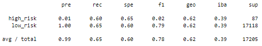
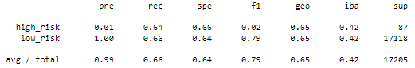
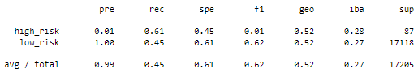
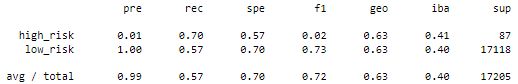
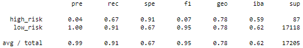
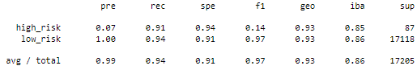

# Credit_Risk_Analysis

## Overview
The goal of the analysis is to utilize unsupervised machine learning tools to help predict credit risk for a peer-to-peer lending service. Our goal is to use over 80 explanatory varaibles to predict the risk of a loan as either "high risk" or "low risk" through a logistic regression model. This choice of functional form is appropriate as our dependent variable is binary in nature and logistical functions are asymptotic at y=0 and y=1.  Tools used in the analysis come from the scikit-learn and imbalanced-learn libraries. Null and incomplete data was removed from the set and different variables were reclassified so that they could be employed in a machine learning model. Given that the number of observations between 'high risk' and 'low risk' was significantly imbalanced, We employed various sampling techiques to rebalance the data to be used in the machine learning algorithms. Types of sampling included random over sampling, SMOTE algorithm, clustered centroids, comination over and under sampling using the SMOTEEN algorithm, and ensemble classicication methods such as random forrest and AdaBoost. 

## Results

### Random Oversampling

- Accuracy: 0.625
- Precision: High - 0.01 Low - 1.0
- Recall: High - 0.6 Low - 0.65

### SMOTE Oversampling

- Accuracy: 0.625
- Precision: High - 0.01 Low - 1.0
- Recall: High - 0.64 Low - 0.66

### Undersampling

- Accuracy: 0.651
- Precision: High - 0.01 Low - 1.0
- Recall: High - 0.61 Low - 0.45

### Combination sampling

- Accuracy: 0.529
- Precision: High - 0.01 Low - 1.0
- Recall: High - 0.7 low - 0.57

### Random Forrest

- Accuracy: 0.788
- Precision: High - 0.04 Low - 1.0
- Recall:  High - 0.67 Low - 0.91

### AdaBoost

- Accuracy: 0.925
- Precision: High - 0.07  low- 1.0
- Recall: High - 0.91 Low - 0.94
- 
## Summary
Overall, our ensemble learning models had higher levels of overall accuracy as compared to other techniques. Further, the AdaBoost model exhibited much higher accuracy in predicting low or high risk loans in the testing set. Additionally, this model was more precise and had a high level of recall. 

